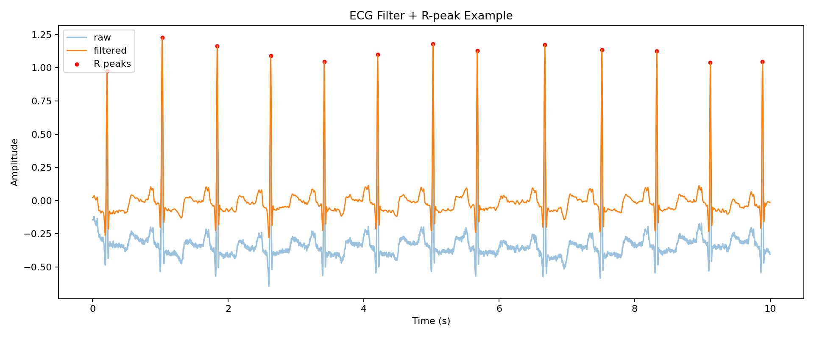
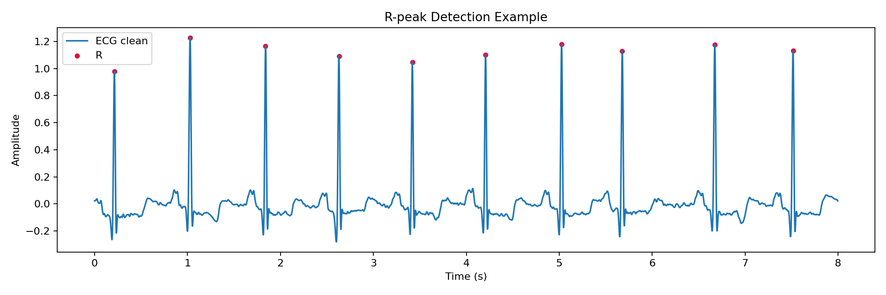
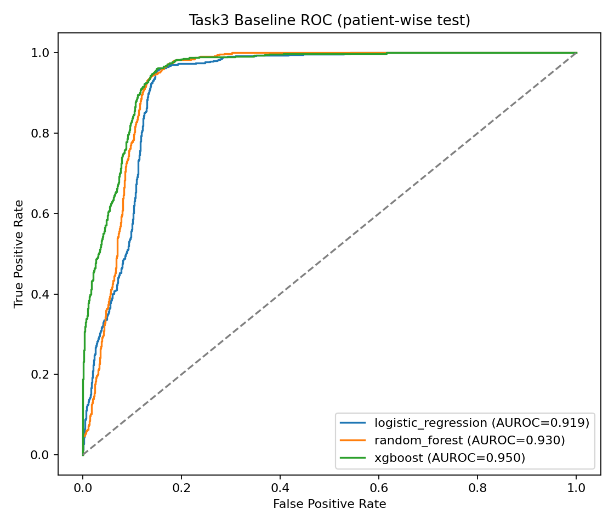
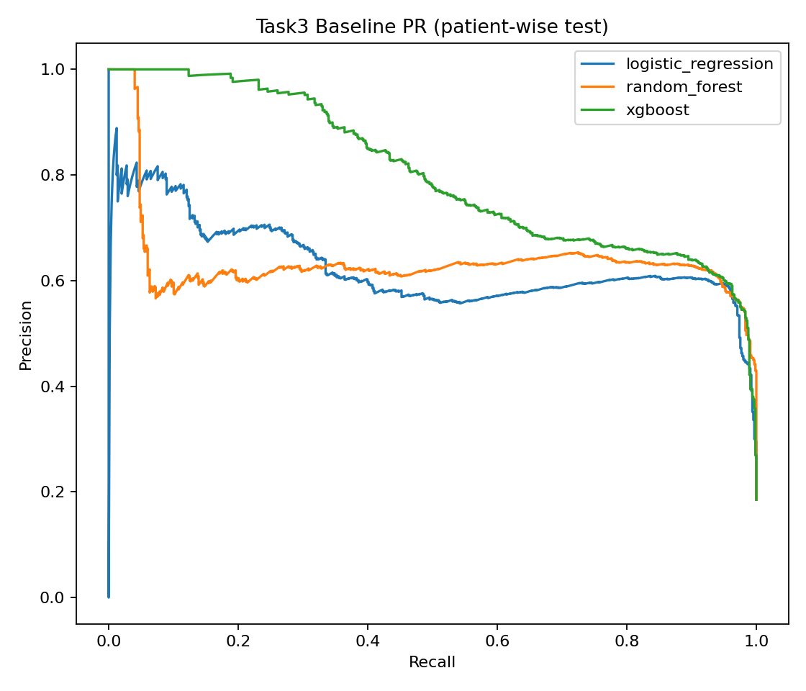
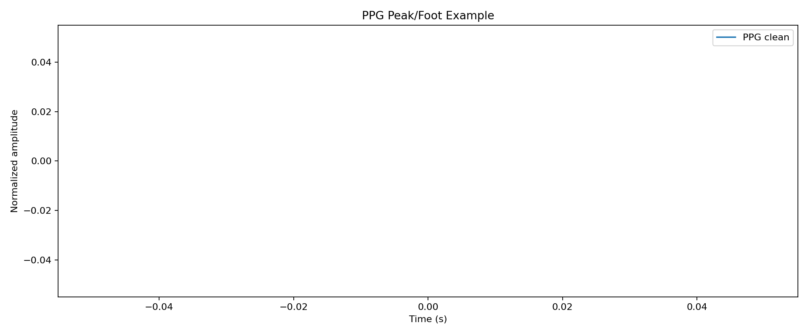
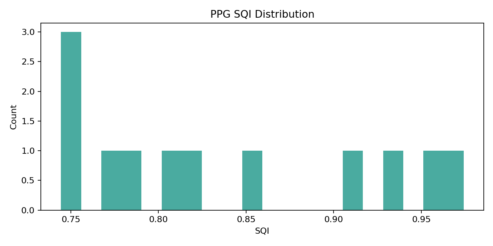
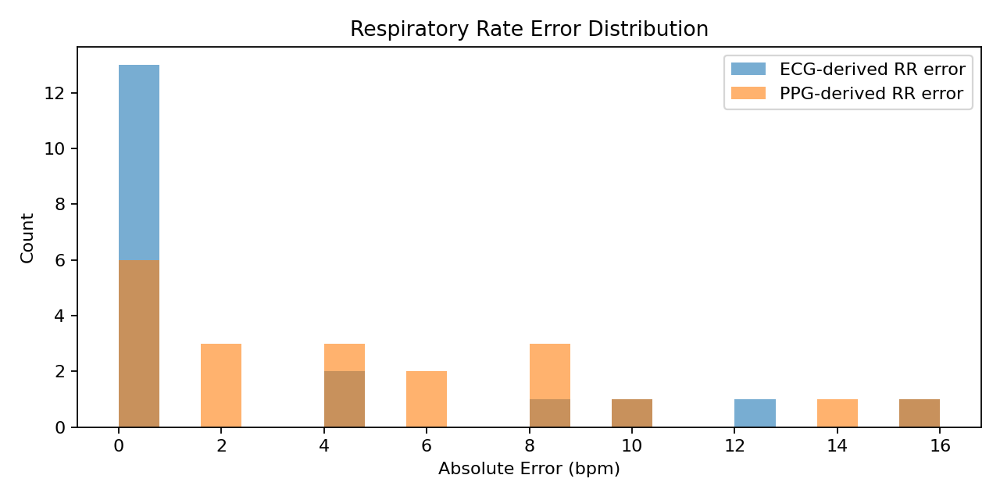
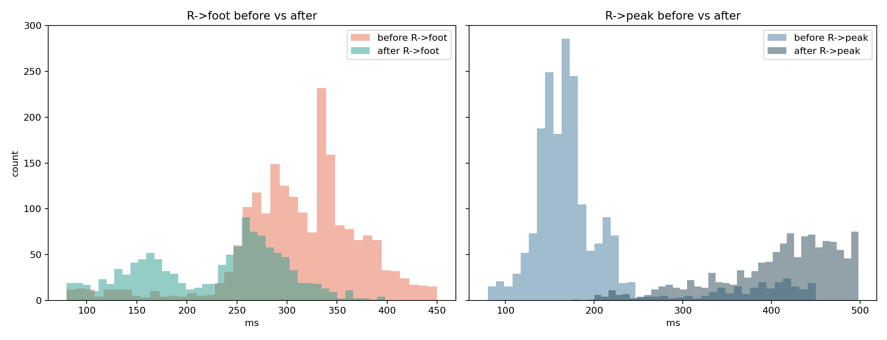
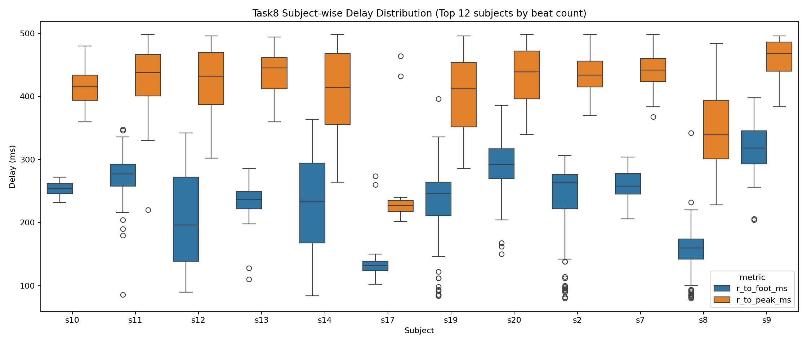

# 封面
- 项目名称：手机壳式 ECG+PPG AI 健康评估系统
- 团队/作者：________（待补）
- 生成日期：2026-04-04
- 项目根目录：`D:/optoelectronic_design/APP`

# 摘要
本项目从全项目视角构建了硬件端、软件端、数据集验证端三位一体体系。硬件端由 ESP32-S3、AD8232、MAX30102 组成，负责 ECG/PPG 原始信号采集、微秒级时间基准、封包和 BLE 传输；软件端由 Android Kotlin 实现，负责 BLE 分包重组、CRC 校验、时间轴重建、本地算法计算、波形显示与报告输出；数据集验证端由 Python Task1~Task9 组成，负责公开数据集离线验证、图表证据生成和迭代回归。当前稳定能力包括 Task1 R峰检测（F1=0.9713）、Task6 PPG 基线（SQI均值=0.8378）、Task8 联合时序修复后主线结果（R->foot=227.45ms，R->peak=406.92ms）。本报告明确：数据集验证模块只是算法验证子系统，不等于项目本体；项目当前定位为工程验证与初步筛查，不是临床诊断系统。

# 1. 项目背景与问题定义
项目面向便携式日常健康监测需求。ECG 反映心脏电活动，PPG 反映外周血流脉动，二者联合可增强节律与循环特征观测。采用“硬件采集 + 手机计算”分工，可以降低硬件复杂度并提高算法迭代效率。

# 2. 基础概念说明
- ECG：心电图，记录心脏电活动。
- PPG：光电容积脉搏波，反映血容量变化。
- R峰：ECG 主要心拍定位点。
- HR：心率（bpm）。
- HRV：心率变异性（SDNN/RMSSD/pNN50 等）。
- AF：房颤，当前项目仅做初步筛查提示。
- SQI：信号质量指标，用于门控输出。
- PTT/PWTT：生理时延特征，用于趋势分析。
- BLE：低功耗蓝牙通信协议。
- 时间戳/同步：通过统一时基和相位参数对齐 ECG/PPG 时间轴。
- 数据集验证：离线验证算法有效性，不代表整机全部能力。

# 3. 全项目总体架构
- 硬件端：采集、封包、传输、状态上报。
- 软件端：接收、重建、计算、显示、报告。
- 数据集验证端：公开数据集任务验证与证据输出。
- 三端关系：硬件提供真实链路数据，软件落地算法，验证端提供可复现证据并回灌参数。
- 核心声明：跑数据集不等于整个项目本体。

# 4. 硬件端设计
- 主控/器件：ESP32-S3 + AD8232 + MAX30102。
- 采样参数：ECG 250Hz（10点/帧），PPG 400Hz（16点/帧），40ms 帧周期。
- 时间与同步：`t_base_us` 微秒时基，手机端结合 `ppg_phase_us` 重建时间轴。
- 协议：132B 业务帧 + 8B 分段头 + CRC16-CCITT-FALSE。
- 传输：NimBLE 自定义服务，支持 start/stop/self-test/sync-mark 等控制。
- 边界：硬件端不做高阶医学诊断，只提供高质量原始数据与状态。

# 5. 软件端设计
- 技术栈：Android/Kotlin/Compose。
- BLE 接收解析：`BlePacketProtocol.kt` + `BleHardwareBridgeRepository.kt`。
- 时间轴重建：`TimelineReconstructor.kt`。
- 本地算法：`CardiovascularSignalProcessor.kt`（实时）+ `BatchCardioAnalyzer.kt`（60秒批处理）。
- 输出策略：60秒采集结束后统一输出，避免实时抖动误导。
- 协议一致性：协议版本、帧结构、采样率、相位参数与固件一致。
- 验证映射：Kotlin/Python 数值一致性 14/14 matched。

# 6. 数据集验证模块设计
- 模块定位：验证算法有效性的子系统，不是项目全部。
- 数据覆盖：ok=10，incomplete=1，missing=1。
- 任务范围：Task1~Task9 覆盖 R峰、HRV、AF、异常搏、P/QT、PPG、呼吸、联合时序、回归门控。
- 比赛意义：提供可复现证据和图表，不替代整机实机联调证据。

# 7. 关键算法与任务结果
## Task1 ECG R峰检测
1. 任务目标：稳定定位 R峰。  
2. 输入数据：ECG。  
3. 数据集：mitdb/nsrdb/nstdb。  
4. 算法：Pan-Tompkins + 自适应阈值。  
5. 状态：稳定。  
6. 关键结果：F1=0.9713, 定位误差=7.40ms。  
7. 图表：`ecg_filter_rpeak_example.png`, `rpeak_detection_example.png`。  
8. 解释：是系统最稳能力之一。  
9. 局限：对体动和接触敏感。  
10. 答辩表述：工程级高可靠 R峰检测能力。  

## Task2 HR/HRV
1. 任务目标：输出 HRV 统计。  
2. 输入：RR 间期。  
3. 数据集：mitdb/nsrdb/afdb。  
4. 算法：RR 统计 + 离群清洗。  
5. 状态：稳定。  
6. 结果：mean HR=80.62bpm, RMSSD=91.67ms。  
7. 图表：`best_metrics.json`。  
8. 解释：可用于趋势监测。  
9. 局限：跨数据源标签口径差异。  
10. 表述：工程分析能力。  

## Task3 AF筛查
1. 目标：房颤初筛。  
2. 输入：RR 不规则特征。  
3. 数据集：afdb/ltafdb/mitdb。  
4. 算法：主线弱标签 + RF；专项重建标签 + XGBoost。  
5. 状态：主线待并回，专项有效。  
6. 结果：主线F1=0.0000, AUROC=0.3792; 专项F1=0.7359, AUROC=0.9499。  
7. 图表：`task3_baseline_roc.png`, `task3_baseline_pr.png`。  
8. 解释：专项显著优于主线旧值。  
9. 局限：双口径并存。  
10. 表述：必须显式区分主线口径与专项口径。  

## Task4 异常搏提示
1. 目标：异常搏风险提示。  
2. 输入：RR + 注释标签。  
3. 数据集：mitdb。  
4. 算法：RR 偏离启发式。  
5. 状态：可用待优化。  
6. 结果：F1=0.6582, Recall=0.8901。  
7. 图表：`best_metrics.json`。  
8. 解释：召回较高。  
9. 局限：误报仍存在。  
10. 表述：提示型能力，不做确诊。  

## Task5 P波/QT流程
1. 目标：流程打通。  
2. 输入：ECG。  
3. 数据集：qtdb/but_pdb。  
4. 算法：SQI门控 + delineation。  
5. 状态：流程可运行。  
6. 结果：success_rate=1.0000, mean_sqi=0.8618。  
7. 图表：`best_metrics.json`。  
8. 解释：工程链路已通。  
9. 局限：临床点级精度未完成验证。  
10. 表述：流程级验证完成。  

## Task6 PPG峰足/SQI/HR
1. 目标：PPG 工程基线。  
2. 输入：PPG。  
3. 数据集：but_ppg/bidmc（ppg_dalia缺失）。  
4. 算法：去趋势+峰足+SQI。  
5. 状态：稳定。  
6. 结果：hr_proxy_mae=0.4352bpm, sqi_mean=0.8378。  
7. 图表：`ppg_peak_foot_example.png`, `ppg_sqi_distribution.png`。  
8. 解释：是稳定工程基线。  
9. 局限：运动泛化证据不足。  
10. 表述：稳定工程基线。  

## Task7 呼吸率
1. 目标：ECG/PPG 导出呼吸率。  
2. 输入：EDR/PDR 序列。  
3. 数据集：bidmc/apnea_ecg。  
4. 算法：Welch 主频。  
5. 状态：可用。  
6. 结果：ECG MAE=2.84bpm, PPG MAE=4.70bpm。  
7. 图表：`rr_estimation_error_distribution.png`。  
8. 解释：ECG 优于 PPG。  
9. 局限：对噪声敏感。  
10. 表述：趋势估计能力。  

## Task8 ECG+PPG联合时序/PTT
1. 目标：提取生理时延特征。  
2. 输入：R峰与PPG峰足。  
3. 数据集：ptt_ppg。  
4. 算法：生理约束配对 + MAD 跳变剔除。  
5. 状态：主线已更新修复后口径。  
6. 结果：R->foot=227.45ms, R->peak=406.92ms。  
7. 图表：`task8_delay_distribution_before_after.png`, `task8_subjectwise_delay_boxplot.png`。  
8. 解释：顺序恢复为生理合理关系。  
9. 局限：用于趋势分析而非临床诊断。  
10. 表述：联合时序工程验证完成；延时不是同步误差。  

## Task9 回归门控
1. 目标：防止关键指标回退。  
2. 输入：跨任务指标。  
3. 数据集：跨任务聚合。  
4. 算法：回归规则检测。  
5. 状态：稳定。  
6. 结果：regression_flags=[]。  
7. 图表：`regression_flags_by_round.png`。  
8. 解释：当前轮次无回归告警。  
9. 局限：可继续扩展规则覆盖。  
10. 表述：具备持续迭代质量控制能力。  

# 8. 图表结果展示

*图注：Task1 ECG 预处理与峰值示例。*

*图注：Task1 R峰检测示例。*

*图注：Task3 ROC 曲线。*

*图注：Task3 PR 曲线。*

*图注：Task6 峰足检测示例。*

*图注：Task6 SQI 分布。*

*图注：Task7 呼吸率估计误差分布。*

*图注：Task8 修复前后时延分布。*

*图注：Task8 受试者维度时延箱线图。*

# 9. 系统创新点与比赛价值
- 三端协同闭环，不是单一算法作业。
- 协议级可观测设计（状态位、自检位、丢帧统计）。
- Task8 修复并主线回灌，体现工程迭代能力。
- 60秒批处理发布策略，降低实时误导。

# 10. 真实性边界与风险说明
- 公开数据结果用于工程验证，不等于临床结论。
- Task3 双口径并存，报告已显式区分。
- Task8 延时是生理特征，不是同步误差。
- QT/P波“能跑通”不等于临床精度验证完成。

# 11. 当前完成度与下一步计划
- 已完成：硬件采集链路、软件分析链路、Task1~Task9 验证体系。
- 最稳能力：Task1、Task6、Task8、Task9。
- 下一步：Task3 专项并回主线、补齐数据缺口、开展实机联调验证。

# 12. 结论
项目已形成可答辩的全链路工程体系，最可信成果是稳定采集、稳定检测、联合时序修复和回归门控。最适合比赛定位是“工程验证充分、具备落地潜力的初步筛查系统”。

# 附录A：关键图表索引
见 `COMPETITION_FIGURE_MANIFEST.md`。

# 附录B：任务-算法-代码映射
见 `outputs/tables/project_task_algorithm_map.csv`。

# 附录C：关键结果总表
- Task1 F1=0.9713
- Task6 SQI=0.8378
- Task8 R->foot=227.45ms, R->peak=406.92ms
- Task3 主线 F1=0.0000, 专项 F1=0.7359

# 附录D：失败案例图（Task3）
见 `project_root/outputs/figures/task3_failure_case_*.png`。

# 附录E：旧逻辑审计图（Task8）
见 `project_root/outputs/figures/task8_visual_audit_*.png`。
